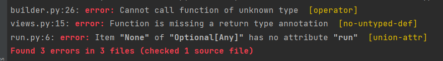
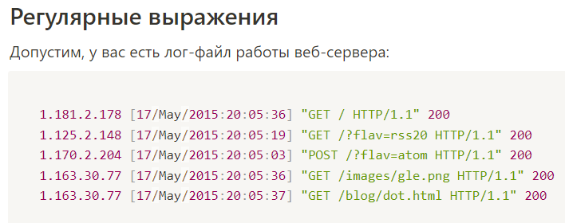
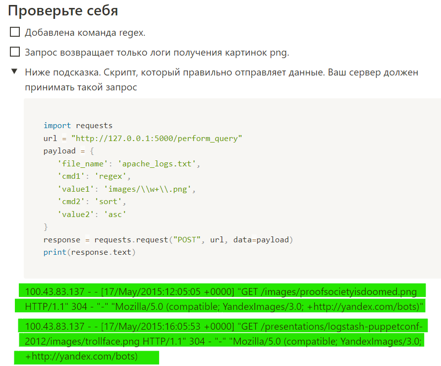

# Skypro_PD_13.0_Sergey_Levchuk_HW_24

## НЕ ПОЛУЧИЛОСЬ ОБРАБОТАТЬ И ВЫВЕСТИ РЕЗУЛЬТАТ
* Три ошибки при запуске `mypy run.py`


В файле `builder.py` 26 строка ему не нравиться **return**
```python
return list(CMD_TO_FUNCTIONS[cmd](value=value, data=prepared_data))
```

В файле `views.py` 15 строка ошибку выводит функция
```python
def perform_query():
```

В файле `run.py` 6 строка ошибка
```python
app.run(debug=True)
```

Самое интересное, что вот такое решение убрало ошибку
```python
if __name__ == '__main__':
    if app is not None:
        app.run(debug=True)
```

### Как решить эти ошибки не знаю

---

### Еще не решенный вопрос, но возможно это правильный вывод запроса. 
У меня выводит ответ вот такой формы
```
    "100.2.4.116 - - [18/May/2015:21:05:22 +0000] \"GET /blog/geekery/mounting-partitions-within-a-disk-image-in-linux.html HTTP/1.1\" 200 9699 \"http://www.semicomplete.com/\" \"Mozilla/5.0 (Macintosh; Intel Mac OS X 10.7; rv:22.0) Gecko/20100101 Firefox/22.0\"\n",
    "100.2.4.116 - - [19/May/2015:04:05:22 +0000] \"GET /blog/geekery/mounting-partitions-within-a-disk-image-in-linux.html HTTP/1.1\" 200 9699 \"http://www.semicomplete.com/\" \"Mozilla/5.0 (Macintosh; Intel Mac OS X 10.7; rv:22.0) Gecko/20100101 Firefox/22.0\"\n",
```

## Но в задании показан вот такой пример


## Хотя ниже приведен пример такой, как я получаю ответ



И вот где правильно не понятно

***
***
## Задача

Усовершенствовать язык программирования и добавить команду — regex.

## Регулярные выражения

Допустим, у вас есть лог-файл работы веб-сервера:

```python
1.181.2.178 [17/May/2015:20:05:36] "GET / HTTP/1.1" 200
1.125.2.148 [17/May/2015:20:05:19] "GET /?flav=rss20 HTTP/1.1" 200
1.170.2.204 [17/May/2015:20:05:03] "POST /?flav=atom HTTP/1.1" 200
1.163.30.77 [17/May/2015:20:05:36] "GET /images/gle.png HTTP/1.1" 200
1.163.30.77 [17/May/2015:20:05:37] "GET /blog/dot.html HTTP/1.1" 200
```

Рассмотрим команду **cmd1=regex value1=<regex>**

Команда regex принимает в качестве аргумента регулярное выражение, по которой нужно будет фильтровать строки входных данных. В результате выполнения команды **cmd1=regex value1=images\/\w+\.png** (запросы в виде images/*.png, то есть получить запросы на картинки png) должно быть выведено:

```python
1.163.30.77 [17/May/2015:20:05:36] "GET /images/gle.png HTTP/1.1" 200
```

## Типизация

После выполнения предыдущего пункта нужно внедрить типизацию в ваш проект. Необходимо добиться, чтобы команда mypy выполнялась без ошибок.

Исходное состояние проекта при запуске mypy:

```python
lesson24_project_solution % mypy app.py
app.py:12: error: Function is missing a type annotation
app.py:37: error: Function is missing a return type annotation
Found 2 errors in 1 file (checked 1 source file)
```

Исходное состояние:

```python
lesson24_project_solution % mypy app.py
app.py:12: error: Function is missing a type annotation
app.py:37: error: Function is missing a return type annotation
Found 2 errors in 1 file (checked 1 source file)
```
